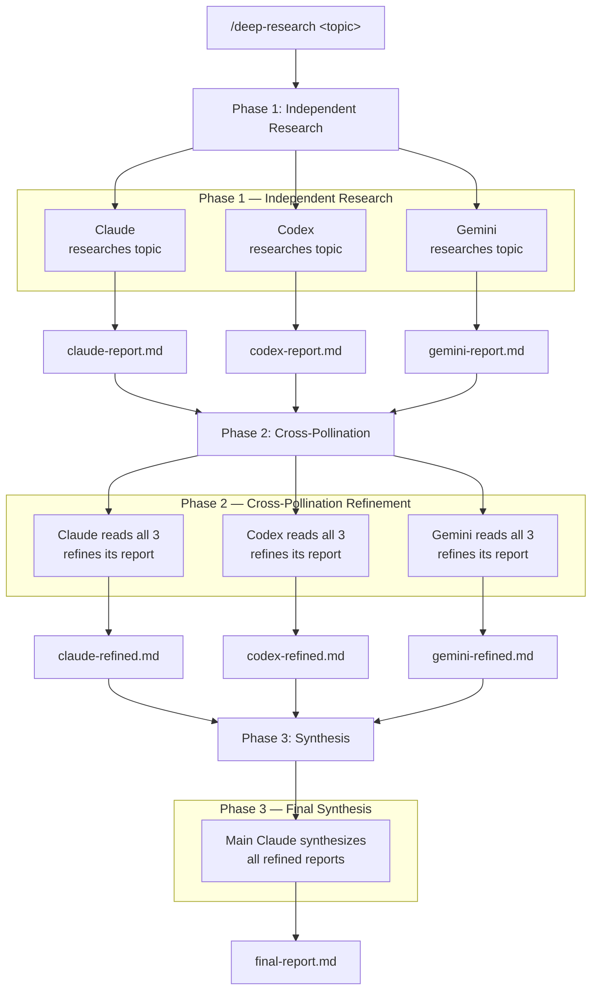

# Research Council

A Claude Code plugin that orchestrates deep research across **three AI agents** in parallel — Claude, Codex, and Gemini — with cross-pollination refinement and final synthesis.

## How it Works

```
/deep-research How do transformer attention mechanisms scale with sequence length?
```

The plugin runs a 3-phase pipeline:



Each agent iterates on its research (using web search, analysis, etc.) until it's satisfied with the depth and coverage, then signals completion. In Phase 2, agents use the other reports as springboards for **new** investigation — not just copying.

## Prerequisites

You need all three coding CLIs installed and authenticated:

### Claude Code
```bash
# Should already be installed if you're reading this
claude --version
```

### Codex CLI (OpenAI)
```bash
npm install -g @openai/codex
codex login
```

### Gemini CLI (Google)
```bash
npm install -g @google/gemini-cli
gemini  # Run once to set up authentication
```

### jq (JSON processor)
```bash
# macOS
brew install jq

# Linux
sudo apt install jq
```

## Installation

### From the command line
```bash
claude plugin marketplace add hamelsmu/research-council
claude plugin install research-council@research-council
```

### From within Claude Code
```
/plugin marketplace add hamelsmu/research-council
/plugin install research-council@research-council
```

### Manual installation (for development)
```bash
git clone https://github.com/hamelsmu/research-council.git
# Then in Claude Code:
claude --plugin-dir /path/to/research-council
```

## Usage

### Full research (production models, up to 10 iterations per agent)
```
/deep-research How do LLMs handle long-context reasoning?
```

### Test mode (cheap models, 2 iterations — for testing the pipeline)
```
/deep-research --test What is the history of the Python programming language?
```

### Cancel an active session
```
/cancel-research
```

### Monitor progress

While research is running, Claude's UI shows a spinner. Open another terminal to watch progress:

```bash
tail -f research/*/progress.log
```

## Output

Reports are saved to `research/<id>/`:

```
research/20260222-143000-a1b2c3/
├── progress.log          # Live progress from all agents
├── claude-report.md      # Phase 1: Claude's initial research
├── codex-report.md       # Phase 1: Codex's initial research
├── gemini-report.md      # Phase 1: Gemini's initial research
├── claude-refined.md     # Phase 2: Claude's cross-pollinated refinement
├── codex-refined.md      # Phase 2: Codex's cross-pollinated refinement
├── gemini-refined.md     # Phase 2: Gemini's cross-pollinated refinement
└── final-report.md       # Phase 3: Synthesized final report
```

## Models Used

### Production (default)

| Agent | Model | Reasoning |
|-------|-------|-----------|
| Claude | `claude-opus-4-6` | effort: max |
| Codex | `gpt-5.3-codex` | reasoning_effort: xhigh |
| Gemini | `gemini-2.5-pro` | thinkingBudget: 24576 |

### Test mode (`--test`)

| Agent | Model | Reasoning |
|-------|-------|-----------|
| Claude | `claude-haiku-4-5-20251001` | default |
| Codex | `gpt-5.1-codex-mini` | reasoning_effort: low |
| Gemini | `gemini-2.5-flash-lite` | default |

## How the Loop Mechanisms Work

Each agent iterates on its research using the best available mechanism for that CLI:

- **Claude**: Native [Stop hook](https://docs.anthropic.com/en/docs/claude-code/hooks) — blocks exit and feeds a "keep researching" prompt back until the agent marks its report complete
- **Codex**: Bash wrapper loop with `codex exec resume --last` — since Codex lacks hooks, we wrap it in an external loop that checks for completion between iterations
- **Gemini**: Native [AfterAgent hook](https://geminicli.com/docs/hooks/) — rejects the response and forces retry with a continuation prompt until complete

Each agent signals completion by writing `<!-- RESEARCH_COMPLETE -->` at the end of its report.

## Troubleshooting

### "Missing required CLI tools"
Install the missing tools listed in the error. All three CLIs (claude, codex, gemini) plus jq must be available on PATH.

### "codex may not be authenticated"
Run `codex login` to authenticate with your OpenAI account.

### "gemini may not be authenticated"
Run `gemini` once interactively to complete OAuth, or set `GEMINI_API_KEY`.

### No reports produced
Check the agent stdout logs in `research/<id>/`:
- `claude-stdout.log`
- `codex-stdout.log`
- `gemini-stdout.log`

Common causes: authentication failures, model not available on your subscription tier, network issues.

### Research seems stuck
Monitor `research/<id>/progress.log`. If an agent is stuck, you can cancel with `/cancel-research` and try again. The orchestrator has a 2-hour timeout as a safety net.

### "A research session is already active"
Run `/cancel-research` first, or check if a previous session is still running.

## Architecture

The plugin uses Claude Code's Stop hook for orchestration. When you run `/deep-research`, the command creates a state file and finishes. The Stop hook then takes over:

1. Launches all 3 research agents as parallel child processes
2. Waits for all to complete
3. Launches all 3 refinement agents in parallel
4. Waits for all to complete
5. Returns control to Claude with a synthesis prompt

This design avoids the 10-minute Bash tool timeout limitation — the Stop hook has a 2-hour timeout, giving agents plenty of time for deep research.

## License

MIT
